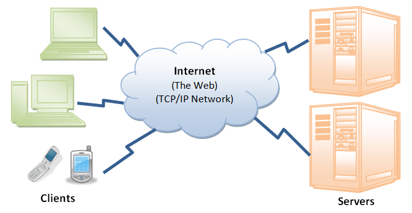

# Introduction to Web

Internet (or The Web) is a massive distributed client/server information system as depicted in the following diagram.

Many applications are running concurrently over the Web, such as web browsing/surfing, e-mail, file transfer, audio & video streaming, and so on.  In order for proper communication to take place between the client and the server, these applications must agree on a specific application-level protocol such as HTTP, FTP, SMTP, POP, and etc.

## HyperText Transfer Protocol (HTTP)
HTTP (Hypertext Transfer Protocol) is perhaps the most popular application protocol used in the Internet (or The WEB).

* HTTP is an asymmetric request-response client-server protocol as illustrated.  An HTTP client sends a request message to an HTTP server.  The server, in turn, returns a response message.  In other words, HTTP is a pull protocol, the client pulls information from the server (instead of server pushes information down to the client).

* HTTP is a stateless protocol. In other words, the current request does not know what has been done in the previous requests.

* HTTP permits negotiating of data type and representation, so as to allow systems to be built independently of the data being transferred.

* Quoting from the RFC2616: "The Hypertext Transfer Protocol (HTTP) is an application-level protocol for distributed, collaborative, hypermedia information systems. It is a generic, stateless, protocol which can be used for many tasks beyond its use for hypertext, such as name servers and distributed object management systems, through extension of its request methods, error codes and headers."

### HTTP Request

Requests consist of the following elements:

* An HTTP method, usually a verb like GET, POST, or a noun like OPTIONS or HEAD that defines the operation the client wants to perform. Typically, a client wants to fetch a resource (using GET) or post the value of an HTML form (using POST), though more operations may be needed in other cases.

* The path of the resource to fetch; the URL of the resource stripped from elements that are obvious from the context, for example without the protocol (http://), the domain (here, developer.mozilla.org), or the TCP port (here, 80).

* The version of the HTTP protocol.

* Optional headers that convey additional information for the servers.

* A body, for some methods like POST, similar to those in responses, which contain the resource sent.

## HTTP Response

Responses consist of the following elements:

* The version of the HTTP protocol they follow.
  
* A status code, indicating if the request was successful or not, and why.

* A status message, a non-authoritative short description of the status code.

* HTTP headers, like those for requests.
Optionally, a body containing the fetched resource.

## Session Handling

Web applications often require a way to track users' interactions across multiple requests. This is where session handling comes into play. Given that HTTP is inherently stateless, sessions provide a mechanism to maintain state across various HTTP requests.

### HTTP's Stateless Nature

- HTTP, the protocol powering the World Wide Web, is inherently stateless.
- This means that each request from a client to a server is treated as an isolated event, with no memory of past requests.
- While this design has its advantages in scalability, it poses challenges when we need to maintain user-specific states, like shopping cart contents or user login status.

### Cookies to the Rescue

- Cookies are the primary method used to introduce state into the stateless HTTP protocol.
- A cookie is a small piece of data, typically in the form of key-value pairs, that a server sends to a client's web browser.
- The browser then stores this cookie and sends it back with every subsequent request to the same server.
- This allows the server to recognize the client and maintain stateful information about the user's session.

### Session IDs

- In the context of session handling, a unique identifier, often referred to as a "session ID," is sent to the client.
- This session ID is typically stored as a cookie in the client's browser.
- When the client makes subsequent requests to the server, it sends the session ID cookie along with the request.
- The server uses this session ID to retrieve session-specific data, such as user preferences or shopping cart contents.

### Security Implications

- Gaining access to a user's cookies, especially the session ID, can potentially allow an attacker to hijack the user's session.
- This is known as "session hijacking" and can lead to unauthorized access to a user's account or sensitive data.
- It's crucial to secure session cookies, often by:
  - Using the `Secure` attribute to ensure the cookie is only transmitted over HTTPS.
  - Using the `HttpOnly` attribute to prevent client-side scripts from accessing the cookie.

# Resources 
1. https://www3.ntu.edu.sg/home/ehchua/programming/webprogramming/http_basics.html
2. https://developer.mozilla.org/en-US/docs/Web/HTTP/Overview